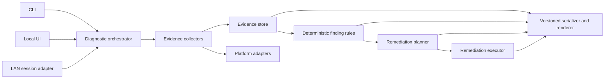
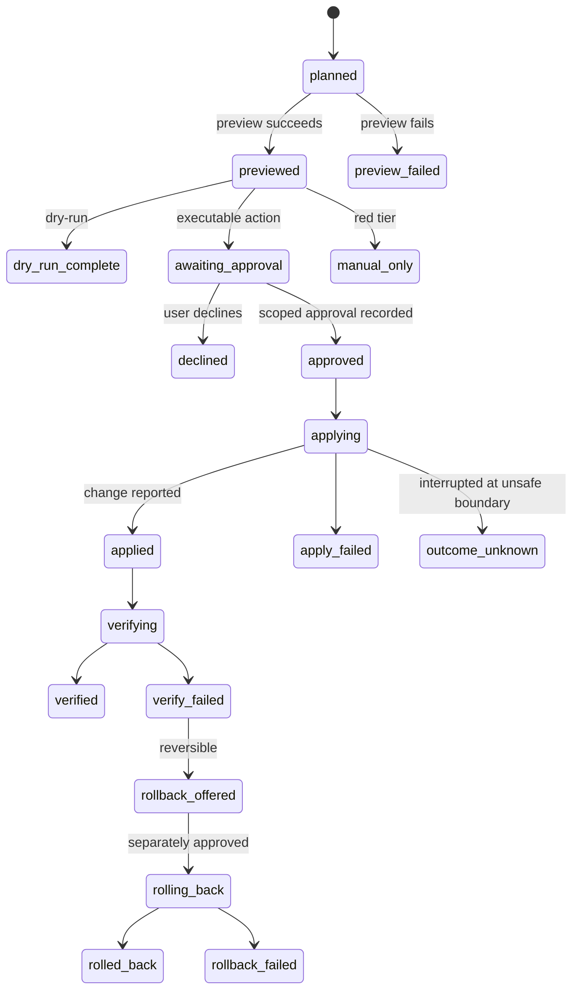

# Lantern core contracts and migration design

Status: proposed for the first post-`v0.2.1` development phase
Scope: diagnostic domain model, orchestration, report compatibility, and remediation safety
Baseline inspected: `v0.2.1` / `0871248`

## Decision summary

Lantern should evolve the existing `netdiag` engine without replacing it. The first increment adds a small, UI-independent domain layer around the proven checks, then migrates checks one at a time. Existing CLI commands, human output, exit codes, and the documented `1.x` JSON fields remain compatible.

The core design separates four things that `v0.2.1` currently combines:

1. **Collection** records typed observations and collection failures.
2. **Diagnosis** applies deterministic rules to evidence and emits stable finding codes.
3. **Planning** identifies applicable remediations and access prerequisites without changing the host.
4. **Execution** previews, explicitly authorizes, applies, verifies, and, where supported, rolls back one allowlisted action.

No generic command, plugin auto-discovery, credential field, or automatic remediation belongs in this core.

## Baseline and constraints

The current code is a sound development baseline:

- Each check returns `(list[Finding], dict)` and does not print.
- `scanner.py` isolates most check failures and assembles a `Report`.
- `report.py` owns human and JSON presentation.
- `findings.py` owns severity and exit-code policy.
- `platform.py` centralizes native command execution.
- The CLI has stable commands and exit codes used on both macOS and Linux/Pi.

The migration must account for these current limitations:

- A `Finding` has no stable code, outcome status, confidence, or evidence references.
- Raw `data` has useful provenance but no common evidence envelope or payload type check.
- Collection and diagnosis are interleaved, so captured evidence cannot be re-analyzed independently.
- `run_full_scan()` hard-codes ordering and performs an unisolated route lookup to decide whether to scan gateway ports.
- Native commands cannot be cooperatively cancelled.
- Redaction discovers string values and replaces them globally, which can alter unrelated text.
- Full-report and single-command JSON use separate assembly paths.
- There is no remediation contract, permission model, or action journal.

Python 3.10 remains the minimum. The diagnostic runtime should retain its zero-third-party-dependency property. JSON Schema validation can be a development dependency rather than a runtime dependency.

## Architectural boundaries



Dependency direction is inward: front ends and platform adapters depend on the core contracts; the core never imports a UI, HTTP server, packaging layer, or platform-specific module. Collectors may use platform adapters, but finding rules are pure functions over evidence.

## Identifier policy

Three identifier namespaces are distinct:

| Kind | Form | Example | Stability rule |
|---|---|---|---|
| Check | lowercase dotted | `netdiag.check.route` | Identifies a collection unit; never reused for a different unit |
| Evidence kind | lowercase dotted | `netdiag.evidence.route.default` | Identifies payload meaning and registered payload type |
| Finding code | uppercase dotted | `NDG.ROUTE.DEFAULT_ROUTE_MISSING` | Identifies one diagnostic meaning; severity and wording may change |
| Action | lowercase dotted | `netdiag.action.dns.flush_cache` | Identifies one allowlisted remediation contract |

Identifiers never contain a tool version, OS version, severity, hostname, address, or other observed value. A semantic change gets a new identifier. Deprecated identifiers remain reserved forever and may carry a `superseded_by` entry in the catalog.

A finding code can occur more than once in a report, for example once per DNS domain. A report-local `finding_id` such as `finding-0007` distinguishes occurrences. Report-local identifiers are monotonically allocated and must not hash sensitive values.

### Initial finding catalog

The first migration should register every condition currently emitted. Suggested codes are:

| Area | Codes |
|---|---|
| Orchestration | `NDG.CHECK.EXECUTION_FAILED`, `NDG.CHECK.CANCELLED` |
| Route | `NDG.ROUTE.DEFAULT_ROUTE_MISSING`, `NDG.ROUTE.GATEWAY_ICMP_REACHABLE`, `NDG.ROUTE.GATEWAY_ICMP_NO_REPLY`, `NDG.ROUTE.OUTBOUND_HTTPS_REACHABLE`, `NDG.ROUTE.OUTBOUND_HTTPS_FAILED`, `NDG.ROUTE.PUBLIC_ICMP_NO_REPLY` |
| DNS | `NDG.DNS.RESOLVERS_CONFIGURED`, `NDG.DNS.RESOLVERS_MISSING`, `NDG.DNS.DOMAIN_BLOCKED`, `NDG.DNS.RESOLVER_INCONSISTENT`, `NDG.DNS.RESOLUTION_FAILED`, `NDG.DNS.ANSWER_VARIANCE`, `NDG.DNS.RESOLUTION_SUCCEEDED` |
| Wi-Fi | `NDG.WIFI.UNSUPPORTED`, `NDG.WIFI.NOT_CONNECTED`, `NDG.WIFI.CONNECTED`, `NDG.WIFI.SIGNAL_STRONG`, `NDG.WIFI.SIGNAL_FAIR`, `NDG.WIFI.SIGNAL_WEAK`, `NDG.WIFI.HIGH_BAND`, `NDG.WIFI.LINK_RATE_REPORTED` |
| LAN | `NDG.LAN.NEIGHBORS_FOUND`, `NDG.LAN.NEIGHBORS_PARTIAL`, `NDG.LAN.NEIGHBORS_FAILED`, `NDG.LAN.ACTIVE_SCAN_SCOPE_MISSING`, `NDG.LAN.ACTIVE_SCAN_SCOPE_TOO_LARGE`, `NDG.LAN.ACTIVE_SCAN_COMPLETE`, `NDG.LAN.DUPLICATE_IP_SUSPECTED` |
| mDNS | `NDG.MDNS.BROWSE_FAILED`, `NDG.MDNS.UNSUPPORTED`, `NDG.MDNS.SERVICES_FOUND`, `NDG.MDNS.NO_SERVICES_SEEN` |
| Ports | `NDG.PORTS.OPEN_PORTS_FOUND`, `NDG.PORTS.NONE_OPEN_HOST_REACHABLE`, `NDG.PORTS.NONE_OPEN_INCONCLUSIVE` |

The catalog is data, not control flow. It records category, default wording keys, documentation link, lifecycle state, and optional supersession. Rules still choose severity and confidence from the observed context.

## Domain contracts

### Status is not severity

The model must not force collection state, diagnostic outcome, and UI urgency into one enum.

`ExecutionStatus` describes whether a collection or action step ran:

- `completed`
- `partial`
- `failed`
- `cancelled`
- `not_run`

`OutcomeStatus` describes what a test concluded:

- `healthy`
- `informational`
- `degraded`
- `failed`
- `blocked`
- `inconclusive`
- `not_tested`
- `unsupported`
- `permission_denied`
- `cancelled`

The existing `Severity` remains the presentation/exit-code dimension: `ok`, `info`, `warn`, or `crit`. Examples:

- A router that declines ICMP while HTTPS works is `inconclusive` for the ICMP observation, `info` severity, and does not degrade overall health.
- DNS filtering that returns `0.0.0.0` is `blocked`; its severity is rule- and profile-dependent rather than inherently critical.
- A Wi-Fi check on an Ethernet-only Linux host is `not_tested` or `unsupported`, not `failed`.
- A collector denied a protected API is `permission_denied`; the report can remain otherwise healthy but is incomplete.

`Confidence` uses `low`, `medium`, or `high`, plus a short rationale and the evidence references that justify it. Do not emit an uncalibrated numeric probability. A future statistically calibrated score can be additive.

### Typed evidence

The internal evidence envelope is generic over a concrete frozen payload dataclass:

```python
@dataclass(frozen=True)
class Evidence(Generic[PayloadT]):
    evidence_id: str
    kind: str
    check_id: str
    status: OutcomeStatus
    source: str
    observed_at: str
    duration_ms: int
    payload: PayloadT | None
    error: ErrorDetail | None = None
    sensitivity: Sensitivity = Sensitivity.PUBLIC
```

`source` names the mechanism, not an executable string: examples are `macos.route`, `linux.ip_route`, `sysctl_rtm`, `python.socket`, and `avahi_browse`. `ErrorDetail` contains a normalized error code, safe message, retryability, and optional native exit code. It never contains a credential or unrestricted command line.

Concrete payloads such as `RouteSnapshot`, `DNSQueryObservation`, `WifiLinkObservation`, `NeighborSnapshot`, and `PortObservation` are frozen dataclasses. The evidence-kind registry maps every kind to exactly one payload class and serializer. Registration fails on duplicate identifiers or a payload-class mismatch.

This gives type checking and deterministic serialization while keeping JSON payloads natural. A whole legacy `data` dictionary may be temporarily wrapped as `netdiag.evidence.<check>.legacy_snapshot`, but it is not considered migration complete until meaningful fields use registered payloads.

### Findings

The upgraded `Finding` retains the current positional fields during migration and adds keyword-only fields:

```python
@dataclass
class Finding:
    severity: Severity
    category: str
    title: str
    detail: str
    hint: str = ""
    data: dict[str, JsonValue] = field(default_factory=dict)
    code: str | None = field(default=None, kw_only=True)
    status: OutcomeStatus = field(default=OutcomeStatus.INFORMATIONAL, kw_only=True)
    confidence: Confidence = field(default_factory=Confidence.medium, kw_only=True)
    evidence_refs: tuple[str, ...] = field(default=(), kw_only=True)
    remediation_refs: tuple[str, ...] = field(default=(), kw_only=True)
```

The optional `code` is only a short migration bridge so existing tests and third-party imports do not fail immediately. Product registration and release tests reject any emitted finding without a registered code. `netdiag/findings.py` remains as a compatibility import surface and re-exports the domain types.

Finding text is eventually rendered from a registered template and typed parameters. Dynamic values are not interpolated into an irreversible string before redaction. Existing `title`, `detail`, and `hint` remain in JSON and human output for compatibility.

### Collection and diagnosis

The new contracts are:

```python
@dataclass(frozen=True)
class CheckContext:
    os: OSInfo
    runner: CommandRunner
    clock: Clock
    cancellation: CancellationToken
    policy: ScanPolicy
    evidence: EvidenceStore


@dataclass
class CheckResult:
    check_id: str
    execution_status: ExecutionStatus
    evidence: list[Evidence[Any]]
    legacy_data: dict[str, JsonValue]
    started_at: str
    duration_ms: int
    error: ErrorDetail | None = None


class Collector(Protocol):
    def __call__(self, context: CheckContext) -> CheckResult: ...


class FindingRule(Protocol):
    def __call__(self, evidence: EvidenceStore) -> list[Finding]: ...
```

`ScanPolicy` records the maximum permitted activity (`passive`, `low_impact_network`, or `active_discovery`), explicit target/interface/network scope, host limits, per-check deadlines, and whether remediation planning is requested. The orchestrator enforces policy before invoking a collector; collectors also validate their exact targets. The existing CLI invocation supplies a compatibility policy that preserves current behavior. A future UI supplies policy from the consent screen.

The orchestrator executes explicitly registered collectors in deterministic topological order, stores completed evidence, and then runs pure rules. A failed dependency does not crash dependents: the dependent run is recorded as `not_run` with an explicit reason. Gateway-port collection consumes route evidence instead of calling `get_routes()` before the isolation boundary.

### Explicit registries

`CheckRegistry`, `FindingRegistry`, `EvidenceKindRegistry`, and `ActionRegistry` are explicit allowlists. The default catalog is built by normal imports in one deterministic function. Do not scan modules, load arbitrary entry points, import paths from configuration, or deserialize callables.

Registry validation at startup and in tests enforces:

- unique, grammar-valid identifiers;
- registered finding codes for all product findings;
- known evidence kinds and matching payload types;
- acyclic check dependencies;
- supported platform and activity metadata;
- action risk and permission metadata;
- no executable implementation for red/manual-only actions;
- no unknown remediation reference from a finding.

Third-party extensibility, if ever needed, belongs behind signed package policy and a separate threat model. It is not a Phase 1 requirement.

## Cancellation and bounded work

`CancellationToken` wraps a thread-safe event and optional monotonic deadline. It exposes `is_cancelled`, `remaining_seconds()`, and `raise_if_cancelled()`.

The token is checked:

1. before scheduling each collector;
2. before every native command, socket attempt, and active target;
3. while waiting for a child process or group of futures;
4. after collection and before diagnosis/planning;
5. at safe remediation checkpoints.

`CommandRunner` replaces direct use of `subprocess.run` for parser-facing work. It returns a structured result with separate stdout/stderr, return code, timeout/cancellation flags, and duration; it runs parsers under a stable locale. For cancellable reads, it uses a child process that can be terminated and then killed after a short grace period. Socket and future-based collectors retain short individual timeouts and stop scheduling new targets once cancelled.

Cancellation is not an exception that becomes `NDG.CHECK.EXECUTION_FAILED`. The report status becomes `cancelled`, completed evidence is retained, in-flight checks are marked `cancelled`, and unscheduled checks are `not_run`.

During remediation, cancellation is honored only at declared safe checkpoints. Interrupting an atomic operating-system operation may leave outcome `unknown`; Lantern must then verify state before offering rollback or retry. It must never claim a rollback occurred merely because the process stopped.

## Permission and access prerequisites

Permissions and credentials are modeled separately.

`PermissionRequirement` represents local capabilities such as user-session access, administrator elevation, macOS Full Disk Access, Windows UAC elevation, or a recovery environment. It has an identifier, platform, scope, current state (`granted`, `denied`, `unknown`, or `not_applicable`), reason, and acquisition instructions.

`AccessPrerequisite` reports that outside access is needed, for example router administrator, Pi-hole administrator, ISP account, Wi-Fi access, BitLocker recovery key, or FileVault account/recovery key. It contains only:

- stable prerequisite kind;
- display label;
- system or scope to which it applies;
- why it is needed;
- actions/findings that require it;
- state such as `required`, `confirmed_available`, or `unknown`.

There is deliberately no password, token, recovery-key, secret-answer, or arbitrary metadata field in either contract. The core never accepts or persists secret values. A platform or device-specific adapter requests authorization at the moment of use through the native authorization channel. An access prerequisite that must be used in a browser or router remains a guided manual step until a separately designed credential broker exists.

Phase 1 does not create a privileged helper. Later privileged execution must use a narrow, versioned IPC protocol with one request type per allowlisted action; it must not accept shell text, executable paths, or arbitrary arguments.

## Remediation lifecycle

Diagnosis never invokes remediation. A finding may reference compatible action identifiers; the planner evaluates preconditions and produces an immutable `ActionPlan`.

Each `ActionSpec` declares:

- stable action identifier and documentation;
- supported platforms;
- addressed finding codes;
- preconditions;
- risk tier (`green`, `yellow`, or `red`);
- permission and access prerequisites;
- expected interruption and estimated duration;
- reboot requirement;
- reversibility and rollback support;
- typed preview, apply, verify, and rollback implementations where allowed.

The lifecycle is a state machine enforced by `RemediationEngine`, not by UI convention:



Rules:

- Preview is read-only and can run without apply authorization.
- Dry-run is enforced above the action implementation: `apply()` is not called at all.
- Approval is bound to one action-plan digest, target, preview, and expiry. Changing the plan invalidates approval.
- Green and yellow actions require explicit approval. Yellow actions additionally require verified rollback support or a documented manual recovery path.
- Red actions are guided/manual-only in this engine and have no registered `apply()` callable.
- Verification uses fresh evidence rather than trusting an apply return code.
- Rollback is a separate, explicitly approved transition unless needed to contain an immediately detected partial failure and the preview disclosed that behavior.
- An action cannot be offered if its preconditions, target scope, permission, or platform support are unknown.

`ActionAttempt` is an append-only in-memory audit record for the current report/session: attempt ID, plan digest, action ID, state transitions, timestamps, approvals, safe outcome summaries, and evidence references. It stores no credentials. Cross-process rollback may later require a locally protected journal; that design must define permissions, integrity protection, retention, and redaction before implementation.

No concrete host-changing action is required to validate the Phase 1 engine. Tests should begin with fake actions and a deliberately non-mutating example such as re-running a diagnostic. The first real green action is a later, separately reviewed increment.

## Redaction model

Redaction moves from global substring replacement to serialization of typed values.

`DiagnosticValue[T]` carries a value and one sensitivity classification:

- `public`
- `network_address`
- `device_identifier`
- `user_identifier`
- `potential_secret`

The share-safe policy keeps documented diagnostic IP addresses, replaces device/user identifiers with stable report-local tokens such as `<device-1>`, and always removes potential secrets. A strict policy can also mask network addresses.

Finding templates receive typed parameters. The serializer redacts parameters first and then renders `title`, `detail`, and `hint`. It never searches the final string for sensitive substrings. Evidence payload serializers use registered field classifications. The compatibility `data` object is produced from the same typed payload serializer so raw and compatibility views cannot diverge.

Until every payload is typed, an explicit check-specific JSON-pointer map covers legacy fields. Unknown legacy fields default to the stricter classification in share-safe mode and trigger a test warning. This is safer than a global list of key names and avoids corrupting words such as `ping` when a hostname is `pi`.

## JSON evolution

The next schema is additive `1.1`. Existing top-level keys and existing finding keys keep their meanings. Existing consumers are already instructed to ignore unknown fields.

Minimal share-safe report generated by the current serializer (the opaque ID is an
example of a generation-only value):

<!-- report-1.1-example:start -->
```json
{
  "schema_version": "1.1",
  "tool_version": "0.3.0.dev3",
  "report_id": "report-87b1e3fb1354e9a95f032ad6e644b640",
  "hostname": "<device-1>",
  "os": {
    "system": "Darwin",
    "release": "25.0.0",
    "machine": "arm64"
  },
  "started_at": "2026-08-17T12:00:00Z",
  "duration_ms": 0,
  "status": "not_run",
  "outcome": "not_tested",
  "assessment": "No diagnostic checks produced usable results.",
  "severity": "ok",
  "coverage": {
    "status": "none",
    "planned": 0,
    "completed": 0,
    "partial": 0,
    "failed": 0,
    "cancelled": 0,
    "not_run": 0
  },
  "findings": [],
  "checks": [],
  "evidence": [],
  "access_prerequisites": [],
  "remediation": {
    "available_actions": [],
    "attempts": []
  },
  "data": {},
  "redacted": true
}
```
<!-- report-1.1-example:end -->

Compatibility rules:

1. `hostname`, `os`, `started_at`, `duration_ms`, `severity`, `findings`, and `data` remain present in full reports.
2. Existing finding fields remain present. New finding fields are additive.
3. The current `data.<section>` shapes remain during the entire `1.x` line. They are derived from typed evidence once a check migrates.
4. Existing exit codes remain: `0` healthy/informational, `1` warning, `2` critical or CLI input error. Cancellation should use a newly documented distinct code, proposed `130` for interactive cancellation; it must not masquerade as critical network health.
5. Single-command `--json` keeps its existing top-level keys while gaining the same additive finding fields. It may later use the complete envelope after a compatibility test proves no regression.
6. Report and finding schema versions are independent from the Python package version. `1.1` is not emitted until schema fixtures and compatibility tests pass.
7. No generated `.dev` version is shown as a release. Use it only in an unreleased development branch; set a release version at the release gate.

Publish `netdiag/schemas/report-1.1.schema.json` in the wheel. Tests validate representative raw, share-safe, partial, permission-denied, cancelled, and remediation-attempt reports against it.

## Concrete module plan

### Add

| Module | Ownership |
|---|---|
| `netdiag/core/status.py` | `ExecutionStatus`, `OutcomeStatus`, `Confidence`, `Sensitivity`, risk/lifecycle enums |
| `netdiag/core/values.py` | JSON-safe type aliases, `DiagnosticValue`, deterministic serialization primitives |
| `netdiag/core/evidence.py` | `Evidence`, `ErrorDetail`, payload protocol, `EvidenceStore`, ID allocation |
| `netdiag/core/diagnostics.py` | upgraded finding type, templates/parameters, pure finding-rule protocol |
| `netdiag/core/access.py` | permission and access-prerequisite contracts; no secret values |
| `netdiag/core/execution.py` | `CancellationToken`, `ScanPolicy`, `CheckContext`, `CheckResult`, `CommandRunner` protocol |
| `netdiag/core/registry.py` | validated explicit registries and dependency ordering |
| `netdiag/core/remediation.py` | action specs/plans/results, approval record, lifecycle engine, audit attempt |
| `netdiag/core/redaction.py` | typed-value policies, token allocator, legacy JSON-pointer bridge |
| `netdiag/catalog/findings.py` | stable finding definitions and lifecycle metadata |
| `netdiag/catalog/defaults.py` | explicit construction of default check/evidence/action registries |
| `netdiag/schemas/report-1.1.schema.json` | bundled external JSON contract |

The modules under `core` contain no imports from `netdiag.checks`, `netdiag.cli`, or any front end. The default catalog may import check specs; check modules import only core contracts.

### Change

| Module | Incremental change |
|---|---|
| `netdiag/findings.py` | Compatibility re-exports plus existing `worst_severity`/`exit_code`; later delegate to core diagnostics |
| `netdiag/platform.py` | Preserve `run()`/`run_ok()` wrappers initially; add a structured, stable-locale, cancellation-aware runner and migrate parser calls gradually |
| `netdiag/checks/*.py` | Add registered payload dataclasses, collector entry points, stable finding codes, typed parameters, and token checks; keep current public wrapper functions while tests/users depend on them |
| `netdiag/scanner.py` | Replace the hard-coded section loop with the registry orchestrator; retain `Report`, `run_full_scan()`, and `report_exit_code()` compatibility wrappers |
| `netdiag/report.py` | Route human and JSON output through one serializer/redaction policy without changing the current human layout initially |
| `netdiag/cli.py` | Build scan policy, pass cancellation, preserve all commands/options; later add read-only action listing/preview commands before any apply command |
| `pyproject.toml` | Bundle schema files and add schema/type tooling only to development dependencies |

Do not move platform collectors into a new tree during the contract migration. Keeping the current file locations makes diffs reviewable and parser fixtures easy to associate. Introduce `netdiag/actions/` only when the first real platform action is approved.

## Migration sequence and gates

### Slice A — Contracts with no behavior change

- Add core enums, values, evidence, access, cancellation, registries, and remediation state machine.
- Add fake collector/action tests.
- Keep production scanner and output on existing paths.
- Gate: current 18 tests plus new contract/state tests pass; no platform call or report changes.

### Slice B — Stable findings and structural serialization

- Register every current finding code.
- Add keyword-only fields to `Finding` and update every product emission.
- Add template parameters for all dynamic values.
- Replace redaction with typed/legacy-path serialization.
- Emit additive finding fields behind schema `1.1` fixtures.
- Gate: a test fails if any product finding is unregistered; raw and share-safe golden reports validate; current titles, exit codes, and section order remain.

### Slice C — Typed route and DNS evidence

- Migrate route and DNS first because later checks depend on them.
- Split collection from pure rules while preserving `check_routing()` and `check_dns()` wrappers.
- Add captured macOS/Linux fixtures and offline rule replay tests.
- Gate: no rule invokes native commands; existing CLI output remains semantically equivalent.

### Slice D — Registry orchestration and cancellation

- Migrate remaining checks through a legacy adapter, then typed payloads one at a time.
- Make gateway-port collection depend on route evidence.
- Route subprocesses and active loops through the structured runner/token.
- Gate: dependency failure, timeout, cancellation, and partial-report tests; no unprotected preflight probe.

### Slice E — Remediation planning only

- Map selected findings to action definitions with preconditions and access prerequisites.
- Expose action listing and preview/dry-run in JSON and UI-facing APIs.
- Register fake/manual-only actions; do not change host state.
- Gate: `apply()` cannot be reached in dry-run, red actions have no executor, approvals are plan-bound, and reports contain no credential-shaped fields.

### Slice F — First real green action

- Choose one reversible, high-value action based on observed incidents and platform support.
- Add platform-specific preview/apply/verify/rollback with fault injection.
- Require a separate safety review and explicit user approval before any live-machine execution.
- Gate: permission-denied, partial failure, interruption, verification failure, and rollback tests all pass; independent oversight verdict is `PASS`.

At the end of every slice, run the full suite on a clean environment and inspect a raw and share-safe report. Do not combine the first real remediation with the schema/orchestrator rewrite.

## Test plan

### Contract tests

- Identifier grammar, uniqueness, deprecation, and no reuse.
- Evidence-kind/payload-class enforcement.
- JSON-safe serialization rejects bytes, sets, NaN/infinity, and unknown objects.
- Status/severity combinations and overall severity remain intentional.
- Confidence contains rationale and valid evidence references.
- Permission/access types cannot accept arbitrary secret fields.

### Finding/rule tests

- Every emitted finding has a registered code.
- Same evidence fixture produces deterministic findings and ordering.
- ICMP failure plus successful TCP remains informational/inconclusive.
- Intentional DNS blocking is distinct from resolver failure.
- Unsupported, permission-denied, not-tested, and failed paths serialize distinctly.
- Evidence references exist and no report-local ID is duplicated.

### Orchestration tests

- Collector failure is isolated and dependents become `not_run` with reason.
- Gateway ports consume cached route evidence and do not perform a second preflight route call.
- Deadlines and user cancellation retain prior evidence and yield a cancelled report.
- Cancelling the mDNS child and ping future set leaves no child process running.
- Registry ordering is deterministic and cycles fail at construction.
- Passive policy cannot start ping sweep or arbitrary port discovery.
- Active scope is confined to the approved interface/network/host limit.

### Remediation tests

- Exhaustive state-transition table; invalid transitions fail closed.
- Preview failure, decline, apply failure, interruption/unknown, verify failure, rollback success, and rollback failure.
- Dry-run uses a mock whose `apply()` raises if touched, proving the engine never calls it.
- Approval is rejected after target, preview, expiry, action version, or precondition change.
- Red/manual action registration rejects an apply callable.
- Verification uses new evidence, not the apply result.
- Cancellation only occurs at declared safe checkpoints.
- Audit output contains no command text or credential values.

### Schema and compatibility tests

- Validate full, subcommand, raw, share-safe, partial, cancelled, and remediation reports against `report-1.1.schema.json`.
- Golden `v0.2.1` compatibility assertions for top-level keys, existing finding keys, `data` section shapes, human order, and exit codes.
- Consumers that ignore additive fields can parse `1.1` fixtures.
- Structural redaction covers every registered sensitive payload field.
- Adversarial values such as hostname `pi`, SSID embedded in another word, Unicode names, shell-looking text, and duplicate identifiers do not corrupt other text or leak.
- Raw and redacted serialization do not mutate the in-memory report.

### Platform fixtures

- Captured command/API outputs from the validated Mac and Pi runs, scrubbed before commit.
- Default route with and without an explicit gateway, VPN/point-to-point route, multiple interfaces, and permission failure.
- `sysctl_rtm` and `ip_neigh` provenance/status variants.
- mDNS timeout, empty browse, malformed line, nonzero exit, cancellation, and normalized duplicates.
- Native command nonzero exit and localized host environment while parser locale remains stable.

## Definition of done for the core phase

The core phase is complete only when:

- every product finding has a stable registered code;
- evidence, findings, check execution, and report health have distinct status semantics;
- route and DNS prove the typed collector/pure-rule boundary end to end;
- all checks run through deterministic registry orchestration and cancellation;
- share-safe reports use structural, classification-driven redaction;
- the remediation lifecycle and dry-run behavior are fully tested with no host-changing action;
- permission/access prerequisites contain no secret values;
- schema `1.1` validates representative reports and preserves `1.x` fields;
- existing CLI commands, human output intent, and exit codes remain compatible;
- the complete suite passes in a fresh environment; and
- independent oversight records `PASS` or resolves every condition before the phase is declared complete.

## Hazards requiring deliberate review

1. **Compatibility `data` can become a privacy back door.** It must be serialized from the same classified values as evidence, not copied from a second raw dictionary.
2. **Finding text can leak after field redaction.** Dynamic text must use typed parameters rendered after redaction; global substring replacement is not an acceptable fallback.
3. **A registry can become remote execution by accident.** Keep it an explicit in-process allowlist and never load callables from JSON, entry points, or network content.
4. **Dry-run can be misleading.** It means the engine did not invoke apply; it is not a promise that every precondition will remain true later.
5. **Cancellation during mutation is not rollback.** Interrupted outcomes must be marked unknown and freshly verified.
6. **Severity is not confidence or execution success.** Collapsing these dimensions recreates false alarms and hides incomplete coverage.
7. **A default route need not have a gateway address.** Route evidence must model `has_default_route`, interface, gateway, and route type independently.
8. **Privilege acquisition can undermine the whole boundary.** Do not add generic `sudo`, shell, or arbitrary privileged command execution; design a narrow helper only when a concrete action requires it.
9. **A schema bump can outpace real migration.** Do not emit `1.1` until all newly required fields have truthful values and compatibility fixtures pass.
10. **Report-local IDs must not fingerprint devices.** Allocate opaque/ordinal IDs rather than hashes of hostnames, MAC addresses, SSIDs, or addresses.

This design deliberately makes the first core milestone safer and more explainable without pretending that a remediation product already exists. It creates the contracts needed by Portable, LAN, and Rescue while preserving the useful `netdiag` behavior already validated on Mac and Pi.
